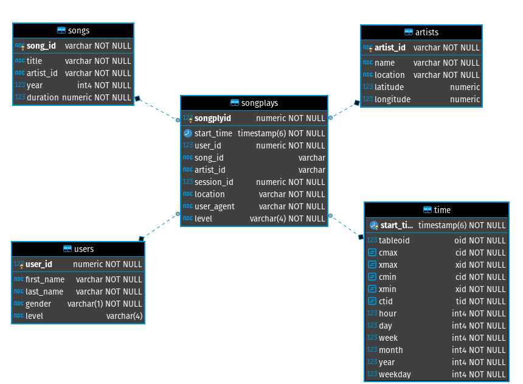

##### Data modelling project

##### Introduction
Sparkify is a startup that runs a music streaming app. The Aparkify analytics team wants to analyse stream data on their app in order to understand what their listeners are listening to.<br/>
This project aims to process the stream data currently in JSON file and store it in a relational database that will allow the analytics team to run queries that will enable them to understand how the app is being used.<br/>
In this project, we will extract all the data and model it in such a way that we will avoid duplication of data across different tables and make it easy to understand.<br/>
In this project, we are using star schema design principle which is ideal for querying a large dataset.

##### Installation
- install python3
- install postgresql
- create a python virtual environment
```python3
    python3 -m venv venv
```
- install pandas and psycopg2 libraries in your python virtual environment
```pip
    pip install pandas
    pip install psycopg2
```
##### Database configuration
Open settings.py and update the following settings
```Postgresql
    host = '127.0.0.1' # database host IP address
    username = 'postgres' # database username
    password = 'postgres' # database password
    db_name = 'sparkifydb' # Database name
```
##### Database design
The image below shows the sparkify database design


##### Running the application
- Run `create_tables.py` to recreate tables
    ```python
    python create_tables.py
    ```
- Run etl.py to process song and log information from json files
    ```python
    python etl.py
    ```
##### Analytics examples
App popularity location
```sql
SELECT count(*), "location" FROM songplays s GROUP BY 2 ORDER BY 1;
```
Most popular artist on the app
```SQL
SELECT count(*), a."name" FROM songplays sp INNER JOIN artists a ON sp.artist_id = a.artist_id GROUP BY 2 ORDER BY 1;
```
Most popular song on the app
```
SELECT count(*), s.title FROM songplays sp INNER JOIN songs s ON sp.song_id = s.song_id GROUP BY 2 ORDER BY 1;
```
